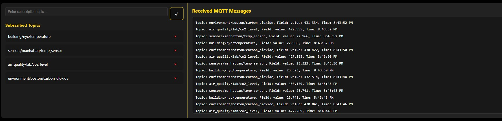
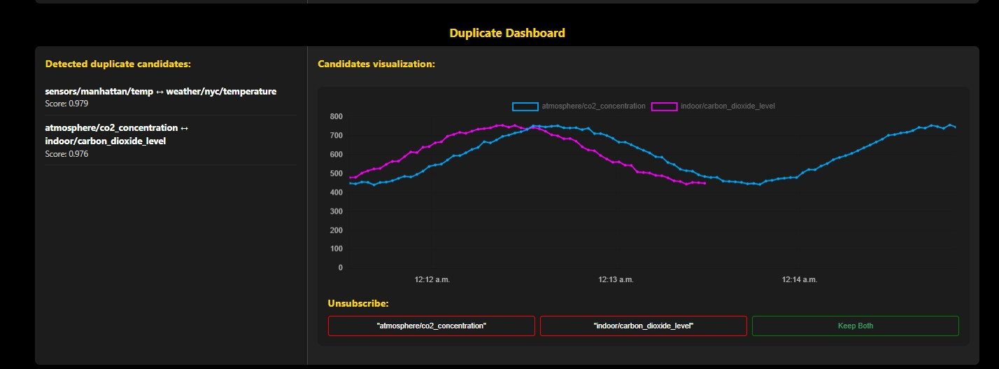
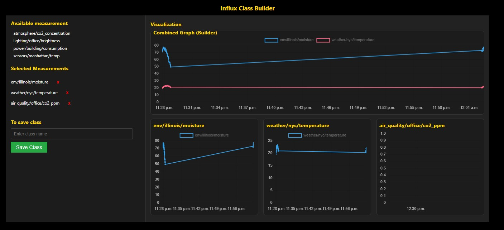

# SmartCity Realtime IoT Hub

## 1. Overview

The **SmartCity Realtime IoT Hub** is a modular IoT platform built using **FastAPI** (backend) and **React (Vite)** (frontend) for real-time telemetry ingestion, semantic analysis, intelligent topic management, and live visualization.

The system combines MQTT streaming, InfluxDB time-series storage, semantic embeddings, duplicate detection, tag-grouping, and user-defined classes — all synchronized instantly to the frontend with WebSockets.

---

## 2. Main Features

### 2.1 Real-Time MQTT Telemetry
- Subscribes to MQTT topics continuously  
- Ingests messages through FastAPI's MQTT handlers  
- Writes numeric sensor readings to **InfluxDB**  
- Supports thousands of messages per second  

### 2.2 Live React Dashboard (Vite + WebSockets)
- Real-time charts  
- Historical time windows  
- Topic browser  
- Duplicate Manager  
- Tag Grouping Panel  
- Saved Classes Manager  
- Live updates via **WebSockets**

### 2.3 Semantic Duplicate Detection
- Embeds topic names and tags using `BAAI/bge-small-en-v1.5`
- Computes cosine similarity  
- Detects semantic duplicates (not just string matches)  
- Stores results in `duplicate_store.json`  
- UI lets users approve/reject duplicates  

### 2.4 Tag-Based Semantic Grouping
- Embeds tag values  
- Groups topics based on semantic similarity  
- Threshold controlled via `.env` (`GROUP_TAG_THRESH`)  
- Visualized in frontend Tag Grouping panel  

### 2.5 Saved Classes
- Users create named groups of topics (e.g., `BuildingA_HVAC`)  
- Persisted in `class_store.json`  
- Loading a class loads all related topics + charts  

### 2.6 Clean Separation of Data Types
- **Telemetry** → InfluxDB  
- **Metadata** → JSON stores  
- Fully portable and database-ready  

---
## 3. User Interface Screenshots

### MQTT Realtime Dashboard


### Duplicate Detection Manager


### Tag Grouping Panel


### Saved Classes Manager



---
## 4. Project Structure

The following structure mirrors your exact folders and includes comments on every line:

```
backend/                             # FastAPI backend (logic, ingestion, services)
│
├── services/                        # All modular backend services
│   ├── duplicate/                   # Duplicate detection helpers
│   ├── embedding/                   # Embedding utilities (model load, generation)
│   ├── influx/                      # Low-level InfluxDB helpers
│   ├── mqtt/                        # MQTT client, subscriptions, handlers
│   └── store/                       # JSON store utilities
│
├── class_manager.py                 # Manages Saved Classes (CRUD operations)
├── dupe_manager.py                  # Main duplicate detection orchestrator
├── embedding_manager.py             # Handles topic/tag embeddings
├── groups_manager.py                # Semantic tag-group management
├── influx_manager.py                # High-level InfluxDB interface
├── query_manager.py                 # Custom query builder for InfluxDB
├── service_manager.py               # Initializes & coordinates backend services
├── socket_manager.py                # WebSocket event broadcaster
├── tag_manager.py                   # Tag parsing & normalization utilities
├── topic_manager.py                 # Registers topics & extracts metadata
│
├── utils/                           # Utility functions used across backend
│
├── .env                             # Local environment config (ignored by Git)
├── .env.example                     # Template env file (safe for Git)
├── config.py                        # Central config loader using dotenv
├── main.py                          # FastAPI entrypoint (API + WS + MQTT)
└── requirements.txt                 # Backend Python dependencies
```

```
frontend/                             # React + Vite frontend application
│
├── public/                           # Static files (HTML, icons)
│
└── src/                              # Frontend source code
    ├── assets/                       # Static assets (images, icons)
    ├── components/                   # UI components
    │   ├── duplicates/               # Duplicate Manager UI
    │   ├── groups/                   # Tag Grouping UI
    │   ├── mqtt/                     # MQTT topic display
    │   ├── classes/                  # Saved Classes UI
    │   └── graphs/                   # Real-time & historical chart components
    │
    ├── hooks/                        # WebSocket + data-fetching hooks
    ├── services/                     # API clients (axios), websocket handlers
    ├── store/                        # Zustand stores (topics, groups, dupes, classes)
    ├── types/                        # TypeScript interfaces
    │
    ├── App.tsx                       # Main application component
    ├── main.tsx                      # Vite entrypoint
    └── index.css                     # Global styles
```

```
test/                                 # Test utilities
└── test_piblisher.py                 # MQTT publisher for testing ingestion
```

```
.gitignore                            # Git ignore rules (env, node_modules, data)
README.md                             # This file
```

---

## 5. Configuration

### 5.1 Create `.env`

Use `.env.example` as a starting point:

```bash
cd backend
cp .env.example .env
```

Then edit:

```
MQTT_BROKER=test.mosquitto.org
MQTT_PORT=1883

INFLUX_URL=http://localhost:8086
INFLUX_BUCKET=smartHub
INFLUX_ORG=Test1
INFLUX_TOKEN=YOUR_REAL_TOKEN

EMBEDDING_MODEL=BAAI/bge-small-en-v1.5
EMBEDDING_DEVICE=cpu

ID_THRESH=0.90
MIN_POINTS=10
DUPE_CHECK_DELAY=60

GROUP_TAG_THRESH=0.85
DATA_DIR=./backend/data
```

---

## 6. Installation

First, clone the repository and move into the project root:

```bash
git clone https://github.com/Ariunlag/influxai_v2
cd influxai_v2

### Backend

```bash
cd backend
python -m venv .venv
source .venv/bin/activate
pip install -r requirements.txt
```

Before running backend, ensure **InfluxDB is started manually**.

### Frontend

```bash
cd frontend
npm install
```

---

## 7. Running the System

### Start Backend
```bash
cd backend
uvicorn main:app --reload
```

Backend API Docs:  
http://localhost:8000/docs

### Start Frontend
```bash
cd frontend
npm run dev
```

Frontend UI:  
http://localhost:5173/

---

# Testing Guide

All tests in this project are simple Python scripts (no pytest required).  
Run them from the project root using:

```bash
python test/<script>.py
```

---

## 8.1 MQTT Publisher Test

Simulates real MQTT sensor messages and verifies:

- Topic ingestion  
- Embedding pipeline  
- Duplicate detection  
- WebSocket event broadcasting  

**Run:**

```bash
python test/test_piblisher.py
```

---

## 8.2 Text Similarity Test

Computes semantic similarity using the same BGE embedding model used by the backend.  
Reads text pairs from:

```
test/data/similarity.txt
```

**Run:**

```bash
python test/test_similarity.py
```

---

## 8.3 Duplicate Detection Test

Runs the full hybrid duplicate pipeline:

- Flattened topic + tag embeddings  
- Synthetic time-series values  
- Hybrid cosine + correlation scoring  
- Duplicate threshold check (`ID_THRESH`)  

Uses:

```
test/data/duplicate_topics.txt
test/data/duplicate_points.txt
```

**Run:**

```bash
python test/test_duplicate.py
```

---

## 8.4 Tag Grouping Test (City / Location Similarity)

Evaluates how **tag values** (not keys) are embedded and clustered.  
Useful for verifying IoT location similarity:  
*“New York City” ↔ “NYC”, “Boston” ↔ “Boston City Center”*  

Features:

- Uses real `EmbeddingManager` and `TagManager`
- Uses an in-memory fake store (no disk writes)
- Prints only groups containing **2 or more distinct tag values**

Reads tag values from:

```
test/data/duplicate_topics.txt
```

**Run:**

```bash
python test/test_tag_groups_from_topics.py
```

---


## 9. Contact Us

**Ahmed Khaled**  
📧 ahmedeeldin@gmail.com  
CS Department, Northeastern Illinois University  

**Ariunaa Tsegmed**  
📧 ariunlag@gmail.com  
Northeastern Illinois University  
